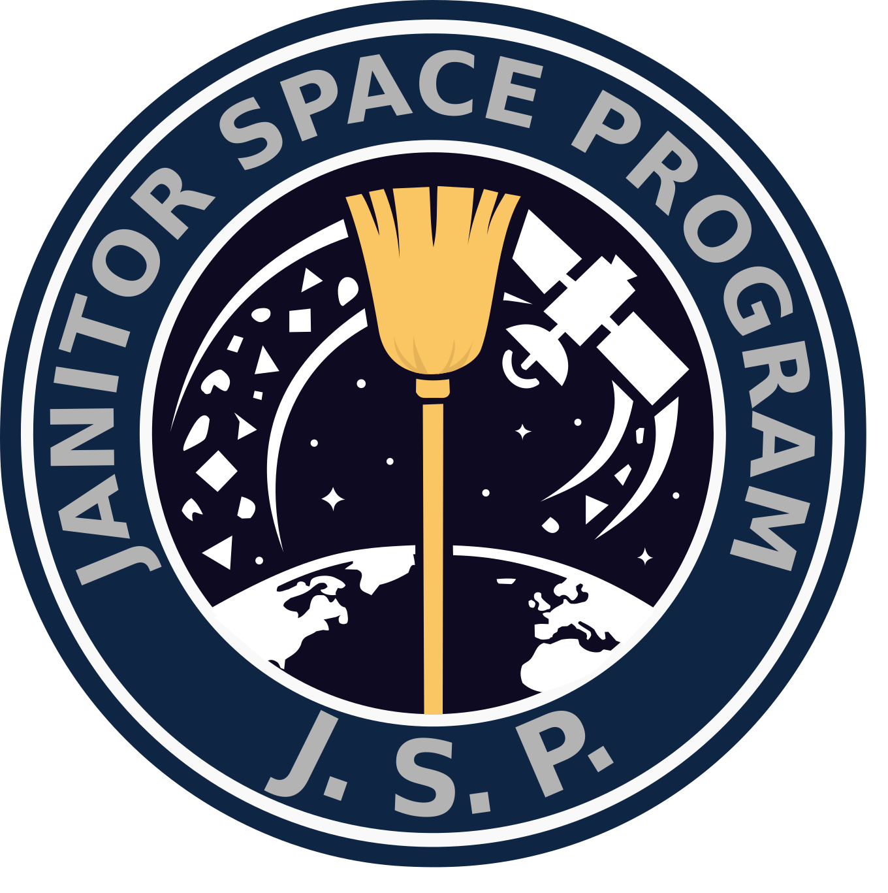
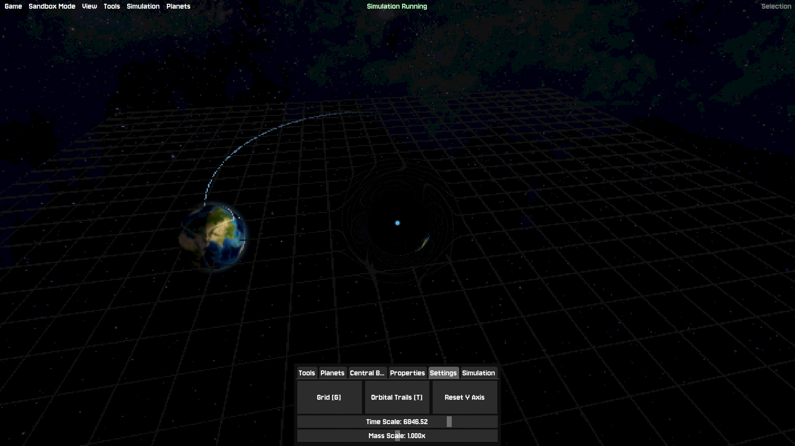
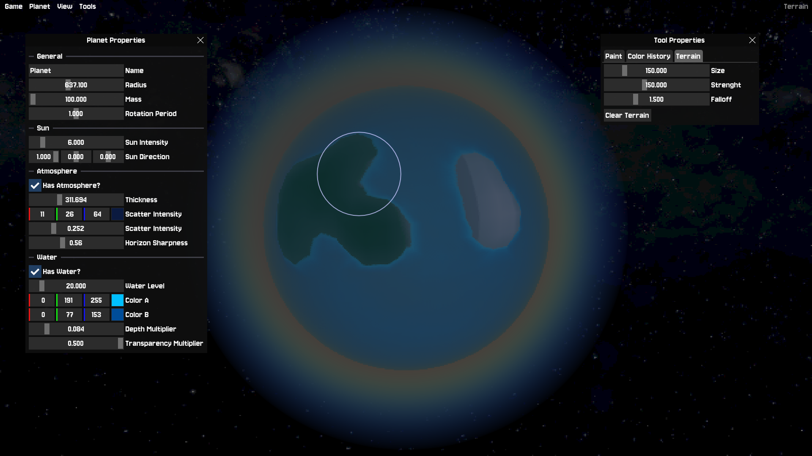
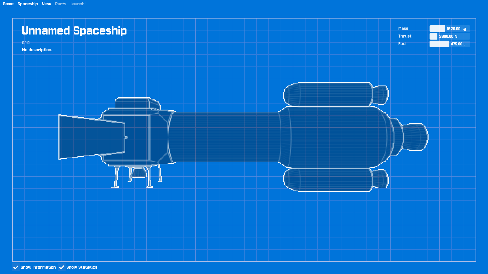
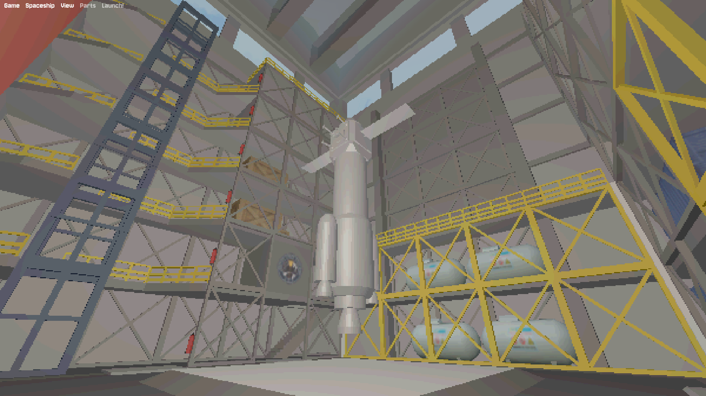

<div align="center">
   
  <h1 style="font-size: 3rem; margin-top: 10px;"><strong>Janitor Space Program</strong></h1>
</div>

* **[Itch.io Page [WIP]](https://aloyak.itch.io/jsp?secret=nkYXIEVo8woJvblBQRYMIrWSFc)**
* **[Origin Engine](https://github.com/aloyak/origin)**

## Overview

Janitor Space Program (J.S.P.) is an explore-adventure 3D game about saving humanity from a devastating Kessler effect in an immersive campaign mode that is expected to last around 3-4 hours, currently in development...

It also features a spaceship and planet editor to create your own projects and have fun modeling your own things. All the planets you create can also be used in the sandbox game mode where you can play around with gravity and create a custom solar system based on your own preferences.

## Screenshots


> `media/1.png` (v0.11.0)


> `media/2.png` (v0.11.0)


> `media/3.png` (v0.11.0)


> `media/4.png` (v0.11.0 WIP)

## Download

Head over to the [Itch.io page](https://aloyak.itch.io/jsp?secret=nkYXIEVo8woJvblBQRYMIrWSFc) to download the latest version of the game. Currently available for Windows & Linux natively

## Technology

This project was built using a custom game engine called [Origin](https://github.com/aloyak/origin). Which is completely open source and free to use for your own projects. Note that the engine is not included in this repository but you only need to run `./update_engine.sh` to download it, it will be included in the build process automatically. This also includes the engine's sandbox editor, although it is not required

The engine and game are written in C++ and uses OpenGL for rendering, which means that the shader language used is GLSL. The engine also uses SDL2 for window management and input handling.

ImGui is used as a GUI library for the editor and game menus

## Assets

Most of the art I created for this project (that is not credited to someone else) is licensed under the same license as the project itself, you can see the final assets in `assets/` but also the source files in `assets_src/` if you want to modify them or use them for your own projects. `assets_src/` is not part of the final build and not required, just like `media/`

## Build

Build natively for linux using Cmake >= 3.23, all depencies are downloaded automatically using CMake's FetchContent module

```sh
git clone https://github.com/aloyak/jsp.git
cd jsp

#chmod +x update_engine.sh
./update_engine.sh

mkdir build

#chmod +x build.sh
./build.sh --no-sandbox
```

The final game binary is found in `build/game/`

**Note**: The sandbox editor is also included with the engine when you run `./update_engine.sh` but it is not required to build the game, you can skip it by using the `--no-sandbox` flag when running `./build.sh`. The sandbox editor is also available in the final build of the game, you can run it by executing `./build/sanbox/sandbox` after building the game

**Note**: For now, you need to manually create a `user/` folder inside the `build/game/` folder, this is where the game will store your save files and settings as a JSON file. Same way, you need to create `user/planets/` and `user/spaceships/` and `user/sandbox/` in order for the game to be able to save these. I need to find a better way to handle this

## License

Please refer to the [LICENSE.md](LICENSE.md) file for more information!